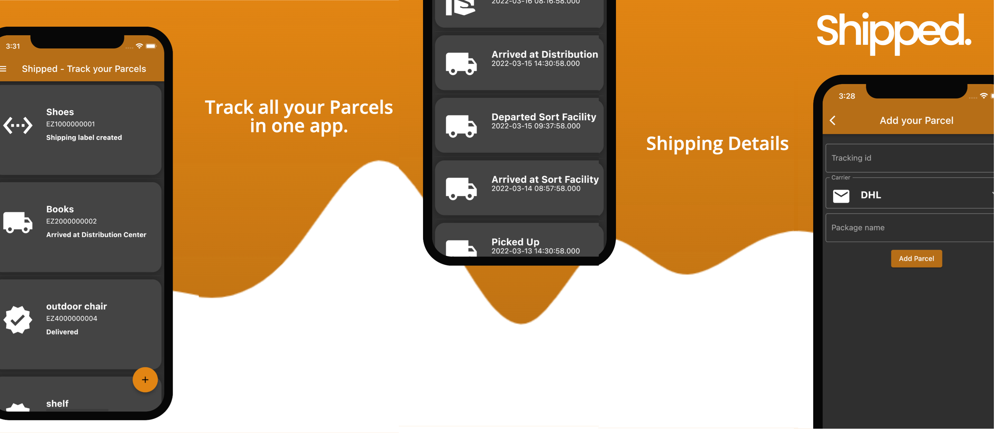

# shipped

Track your Parcels via EasyPost API

# Informations

- My idea was to develop a small app which brings Flutter and its environment a bit closer to me. It was important to me to create a project that would actually have a real use case.
- There are still some things that can be improved about the app.... I'll definitely come back to this when I've really mastered Flutter.

## Features:
- [x] Track a pracel
- [x] nice list ;)
- [x] refresh animation
- [x] Icons for the individual statuses
- [x] detailed view of each parcel
- [x] Dark/Light Mode
- [x] nice animations
- [ ] Treat the detail page with more love <3
- [ ] save parcel to the storage
- [ ] delete / edit old parcels
- [ ] a kind of sorting
- [ ] a way to choose the tracking backand (more individual)
- [ ] ....

## Used Dependencies
- [cupertino_icons: ^1.0.2](https://pub.dev/packages/cupertino_icons)
- [liquid_pull_to_refresh: ^3.0.1](https://pub.dev/packages/liquid_pull_to_refresh)
- [intl: ^0.17.0](https://pub.dev/packages/intl)
- [http: ^0.13.4](https://pub.dev/packages/http)